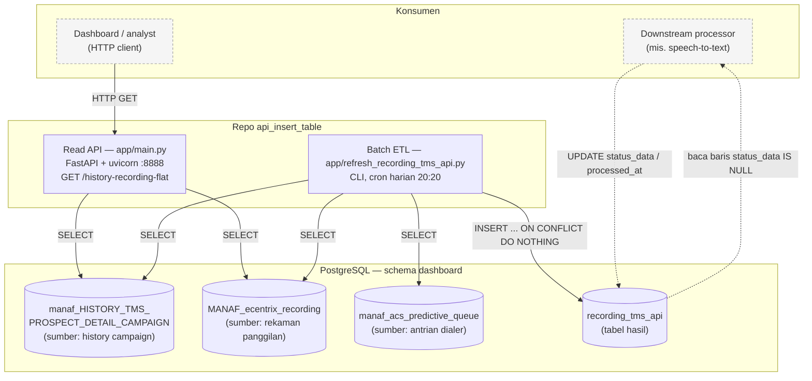
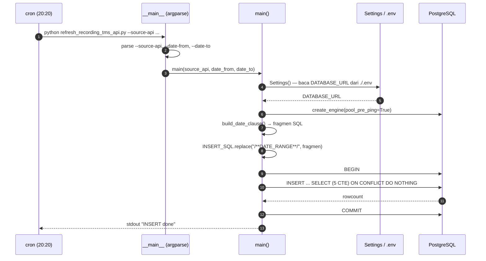
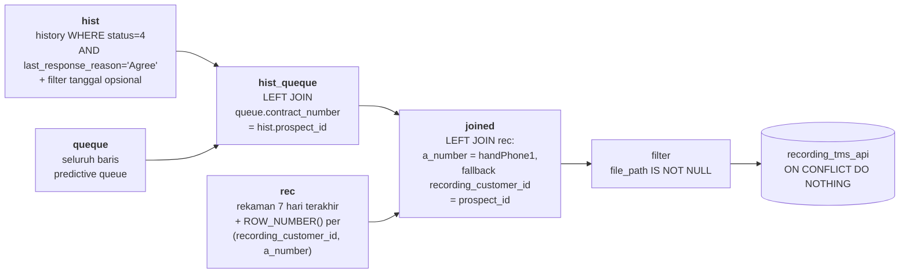
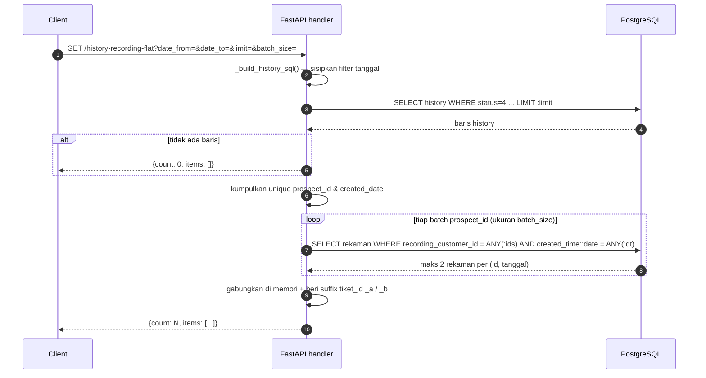

# Arsitektur — api_insert_table

Dokumen ini menjelaskan komponen, alur data, dan keputusan desain yang terlihat langsung dari kode di `app/`.

---

## 1. Gambaran umum

`api_insert_table` bukan aplikasi web bertingkat, melainkan **dua program kecil yang berbagi satu database PostgreSQL**:

1. **Batch ETL job** (`app/refresh_recording_tms_api.py`) — komponen utama, berjalan terjadwal. Melakukan *set-based transformation* penuh di dalam database melalui satu statement `INSERT ... SELECT`.
2. **Read API** (`app/main.py`) — layanan HTTP FastAPI dengan satu endpoint yang menghitung penggabungan history↔rekaman secara *on-demand*, tanpa menyentuh tabel hasil ETL.

Keduanya **tidak saling memanggil**. Tidak ada message broker, queue aplikatif, cache, maupun service eksternal yang dipanggil lewat HTTP dari dalam repo ini.

### Diagram komponen

> Garis putus-putus = konsumen di luar repo ini. Kode untuk mengisi `status_data` / `processed_at` **tidak ada** di repo ini; batch job selalu menulis `NULL` untuk kedua kolom tersebut. Keberadaan konsumen tersebut terlihat dari data produksi (mayoritas baris sudah bernilai `status_data = 'succeeded'`) dan dari index parsial `ix_recording_tms_api_status_null` yang khusus dibuat untuk mencari baris `status_data IS NULL`.

---

## 2. Modul & tanggung jawab

Struktur kode bersifat **flat** — setiap file memuat konfigurasi, SQL, dan logikanya sendiri.

### 2.1 `app/refresh_recording_tms_api.py` — Batch ETL

| Elemen | Tanggung jawab |
|---|---|
| `Settings` | Membaca `DATABASE_URL` dari `.env` (relatif terhadap CWD) via `pydantic-settings`. Properti `sqlalchemy_uri` meneruskan nilainya apa adanya. |
| `TABLE_HISTORY`, `TABLE_RECORDING`, `TABLE_QUEQUE` | Konstanta nama tabel, ditulis **sudah dengan tanda kutip ganda** karena nama tabel di PostgreSQL bersifat *case-sensitive* (mis. `'"MANAF_ecentrix_recording"'`). |
| `INSERT_SQL` | Satu f-string berisi seluruh transformasi: 5 CTE (`hist`, `queque`, `rec`, `hist_queque`, `joined`) → `INSERT ... SELECT` → `ON CONFLICT DO NOTHING`. Berisi placeholder `/**DATE_RANGE**/`. |
| `build_date_clause()` | Membangun fragmen `AND ...` untuk filter tanggal sesuai kombinasi `date_from`/`date_to` yang diberikan. Mengembalikan string kosong bila keduanya `None`. |
| `main()` | Orkestrasi: buat engine → bangun klausa tanggal → substitusi ke SQL → susun parameter → eksekusi dalam satu transaksi (`engine.begin()`). |
| blok `__main__` | Parsing argumen CLI (`argparse`) dan penanganan exception tingkat atas. |

### 2.2 `app/main.py` — Read API

| Elemen | Tanggung jawab |
|---|---|
| `Settings` | Sama seperti di atas, ditambah field nama schema/tabel yang dapat dioverride lewat environment variable. |
| `engine` | Engine SQLAlchemy tingkat modul, dibuat sekali saat import dengan `pool_pre_ping=True` (deteksi koneksi mati) dan `pool_recycle=1800` (daur ulang koneksi tiap 30 menit). |
| `FlatRow`, `FlatResponse` | Model Pydantic untuk response. Seluruh field `FlatRow` bersifat opsional. |
| `SQL_HISTORY` + `_build_history_sql()` | Query history dengan placeholder `/**DATE_FROM**/` dan `/**DATE_TO**/`. |
| `SQL_RECORDING_TOP2` | Query rekaman dengan `ROW_NUMBER()` untuk mengambil **2 rekaman terbaru** per pasangan `(recording_customer_id, tanggal)`. |
| `_chunk()` | Generator pemecah list menjadi potongan berukuran `n`, dipakai untuk membatasi ukuran array parameter. |
| `history_recording_flat()` | Handler endpoint: tiga langkah (ambil history → ambil rekaman → gabung di Python). |

### 2.3 Sumber data

| Tabel | Peran | Kolom kunci yang dipakai |
|---|---|---|
| `dashboard."manaf_HISTORY_TMS_PROSPECT_DETAIL_CAMPAIGN"` | History interaksi campaign per prospect | `id`, `prospect_id`, `agent_id`, `status`, `last_response_reason`, `created_time`, `"MIS_DATE"`, `"JULIAN_MIS_DATE"` |
| `dashboard."manaf_acs_predictive_queue"` | Antrian predictive dialer; penyedia nomor telepon | `contract_number`, `"handPhone1"`, `source`, `account_number`, `class_id`, `last_attempt_datetime` |
| `dashboard."MANAF_ecentrix_recording"` | Metadata rekaman panggilan | `recording_customer_id`, `a_number`, `context`, `file_path`, `created_time`, `duration` |

### 2.4 Tabel tujuan `dashboard.recording_tms_api`

Skema aktual di database (DDL tidak ada di repo — dikelola di luar version control):

| Kolom | Tipe | Null | Diisi oleh job? |
|---|---|---|---|
| `tiket_id` | `varchar(50)` | NO | ya — `id \|\| '_' \|\| TO_CHAR(recording_created_time,'YYYYMMDDHH24MISS')` |
| `file_path` | `varchar(255)` | NO | ya |
| `julian_mis_date` | `text` | YES | ya |
| `mis_date` | `varchar(8)` | YES | ya |
| `id` | `varchar(32)` | YES | ya (id history) |
| `prospect_id` | `varchar(64)` | YES | ya |
| `customer_id` | `text` | YES | ya |
| `cust_name` | `text` | YES | ya |
| `campaign` | `text` | YES | ya |
| `agent_id` | `varchar(64)` | YES | ya |
| `status` | `integer` | YES | ya |
| `created_by` | `text` | YES | ya |
| `created_time` | `timestamp` | YES | ya — `COALESCE(recording_created_time, to_timestamp(mis_date,'YYYYMMDD'))` |
| `created_date` | `date` | YES | ya — `COALESCE(recording_created_time::date, to_date(mis_date,'YYYYMMDD'))` |
| `recording_customer_id` | `varchar(64)` | YES | ya — **diisi dari `prospect_id`**, bukan dari kolom rekaman |
| `recording_created_time` | `timestamp` | YES | ya |
| `a_number` | `varchar(64)` | YES | ya |
| `context` | `varchar(64)` | YES | ya |
| `source_api` | `varchar(255)` | YES | ya — dari argumen `--source-api` |
| `load_date` | `date` | NO | ya — `CURRENT_DATE` (default kolom juga `CURRENT_DATE`) |
| `status_data` | `varchar(9)` | YES | ditulis `NULL`; diisi proses downstream |
| `error_message` | `text` | YES | ditulis `NULL` |
| `inserted_at` | `timestamptz` | NO | tidak — default kolom `now()` |
| `processed_at` | `timestamptz` | YES | tidak — diisi proses downstream |

Constraint & index:

- `PRIMARY KEY (tiket_id, file_path)` — nama constraint `recording_tms_api_pk`; inilah target dari `ON CONFLICT`.
- `CHECK (status_data IN ('succeeded','failed'))`
- `ix_recording_tms_api_status_null` — index parsial `WHERE status_data IS NULL` (antrean kerja downstream)
- `ix_recording_tms_api_load_date`
- `ix_recording_tms_api_prospect_date` — `(prospect_id, created_date)`
- `ix_recording_tms_api_rec_key_date` — `(recording_customer_id, created_date)`

---

## 3. Alur data

### 3.1 Batch ETL — dari cron sampai baris tersimpan

### 3.2 Transformasi di dalam `INSERT_SQL`

Penjelasan tiap tahap:

1. **`hist`** — menyaring history menjadi hanya interaksi yang *closed-won*: `status = 4` **dan** `last_response_reason = 'Agree'`. Filter tanggal opsional disisipkan di sini melalui placeholder `/**DATE_RANGE**/`, memakai kolom ternormalisasi `COALESCE(h.created_time::date, to_date(h.mis_date,'YYYYMMDD'))`.
2. **`queque`** — mengambil data antrian predictive dialer. Perannya semata sebagai **jembatan nomor telepon**: memetakan `prospect_id` ke nomor HP pelanggan (`"handPhone1"`).
3. **`rec`** — rekaman dalam 7 hari terakhir, diberi `ROW_NUMBER()` per `(recording_customer_id, a_number)` urut waktu terbaru. Catatan: kolom `rn` yang dihasilkan **tidak difilter** di query final, sehingga seluruh rekaman yang cocok tetap ikut, bukan hanya yang terbaru.
4. **`hist_queque`** — `LEFT JOIN` history ke queue pada `contract_number = prospect_id`. Memakai `LEFT JOIN` agar history tanpa padanan di queue tidak hilang.
5. **`joined`** — inti penjodohan, dengan **dua strategi berjenjang** dalam satu kondisi `OR`:
   - bila `handPhone1` tersedia → cocokkan rekaman berdasarkan **nomor telepon** (`r.a_number = hq."handPhone1"`);
   - bila `handPhone1` `NULL` → jatuh kembali ke pencocokan berdasarkan **ID pelanggan** (`r.recording_customer_id = hq.prospect_id`).
6. **Filter akhir & insert** — hanya baris ber-`file_path` yang disimpan (baris tanpa rekaman dibuang), lalu `INSERT` dengan `ON CONFLICT (tiket_id, file_path) DO NOTHING`.

### 3.3 Read API — `GET /history-recording-flat`

Aturan penomoran `tiket_id` pada API ini:

| Jumlah rekaman untuk satu baris history | `tiket_id` yang dihasilkan | Jumlah baris output |
|---|---|---|
| 2 rekaman | `<id>_a` (terbaru), `<id>_b` | 2 |
| 1 rekaman | `<id>` (tanpa suffix) | 1 |
| 0 rekaman | `<id>`, kolom rekaman bernilai `null` | 1 |

> Skema penomoran ini **berbeda** dari yang dipakai batch job, yang membentuk `tiket_id` sebagai `<id>_<YYYYMMDDHH24MISS>`. Kedua komponen tidak menghasilkan `tiket_id` yang saling kompatibel.

---

## 4. Keputusan desain

### 4.1 Pola arsitektur: *script-oriented*, bukan berlapis

Tidak ada pemisahan router/service/repository, tidak ada dependency injection, tidak ada ORM model. Setiap file adalah unit mandiri yang memuat konfigurasi, SQL, dan logikanya sendiri. Untuk ruang lingkup dua program berukuran ±180–260 baris, ini menghindari *overhead* struktur yang tidak terpakai — dengan konsekuensi SQL dan logika aplikasi saling bercampur, dan tidak ada titik yang mudah disisipi unit test.

### 4.2 Transformasi didorong ke database (*push-down*)

Batch job **tidak** memindahkan baris ke Python. Seluruh join, window function, normalisasi tanggal, dan pembentukan `tiket_id` dikerjakan oleh PostgreSQL dalam satu statement, dan Python hanya bertugas menyusun string SQL serta mengeksekusinya. Keuntungannya: tidak ada data besar yang melewati jaringan dan seluruh operasi berada dalam satu transaksi atomik. Kerugiannya: logika bisnis tersimpan sebagai string SQL yang praktis tidak bisa diuji per bagian.

Read API mengambil pendekatan sebaliknya: **sengaja menghindari JOIN** (lihat komentar `# Step 2: RECORDING (no JOIN, dibatch)` di kode) dan melakukan penggabungan di memori Python. Ini kemungkinan besar dimaksudkan untuk menghindari rencana eksekusi join yang mahal pada tabel besar, dengan menukarnya menjadi dua query terpisah plus penggabungan berbasis dictionary.

### 4.3 Idempotensi lewat primary key alami

`tiket_id` dibentuk deterministik dari `id` history dan timestamp rekaman, lalu dipasangkan dengan `file_path` sebagai primary key. Kombinasi ini membuat `ON CONFLICT (tiket_id, file_path) DO NOTHING` cukup untuk menjamin job aman dijalankan berulang — tanpa perlu tabel staging, penanda *watermark*, atau operasi `DELETE` sebelum insert.

### 4.4 Injeksi SQL via placeholder komentar

Filter dinamis disisipkan dengan `str.replace()` pada penanda berbentuk komentar SQL (`/**DATE_RANGE**/`, `/**DATE_FROM**/`, `/**DATE_TO**/`). Nilai yang berasal dari pengguna **tidak pernah** ikut disisipkan lewat cara ini — yang disisipkan hanyalah fragmen SQL statis, sedangkan nilainya tetap dikirim sebagai bind parameter (`:date_from`, `:date_to`, `:source_api`, `:limit`, `:ids`, `:dt`). Dengan demikian pola ini tidak membuka celah SQL injection.

Perlu dicatat, penanda berformat komentar juga membuat template SQL tetap valid secara sintaks meski tidak disubstitusi — sehingga kesalahan substitusi tidak langsung terdeteksi sebagai syntax error.

### 4.5 Konfigurasi: satu URL, bukan komponen terpisah

Baik `main.py` maupun `refresh_recording_tms_api.py` sekarang menerima satu `DATABASE_URL` utuh. Sisa kode yang menyusun URI dari `PG_HOST`/`PG_PORT`/`PG_USER`/`PG_PASSWORD`/`PG_DATABASE` masih ada dalam bentuk komentar. Konsekuensinya, `.env` **wajib** berada di direktori kerja saat proses dijalankan — inilah alasan entri cron melakukan `cd /data/api_insert_table/app` terlebih dahulu.

### 4.6 Pencocokan berbasis nomor telepon dengan fallback

Keputusan paling substansial pada job adalah menjodohkan rekaman lewat **nomor telepon** (`a_number` ↔ `handPhone1`) alih-alih lewat ID pelanggan. Pendekatan ini menuntut adanya `LEFT JOIN` tambahan ke tabel antrian dialer semata untuk memperoleh nomor telepon tersebut. Klausa `OR` menyediakan jalur cadangan ke pencocokan berbasis `recording_customer_id` bila nomor telepon tidak tersedia, sehingga baris history tanpa padanan di antrian tetap berpeluang memperoleh rekaman.

Efek samping yang perlu disadari: karena pencocokan dilakukan per nomor telepon dan hasil `rn` tidak difilter, satu baris history dapat menghasilkan **beberapa** baris output — satu per file rekaman. Hal ini konsisten dengan bentuk primary key `(tiket_id, file_path)`.

---

## 5. Batasan yang diketahui

Ringkasan; uraian lengkap ada di [README — Catatan & Known Issues](../README.md#catatan--known-issues).

| # | Batasan | Dampak |
|---|---|---|
| 1 | Jendela rekaman pada job dipatok `CURRENT_DATE - INTERVAL '7 days'` | `--date-from`/`--date-to` di luar 7 hari terakhir selesai normal namun tidak menghasilkan baris |
| 2 | Tidak ada logging terstruktur maupun jumlah baris yang dilaporkan | Sulit mengaudit hasil setiap eksekusi dari log |
| 3 | Parameter `batch_size` pada API hanya memecah daftar `ids`, sedangkan `dt` selalu dikirim utuh | Ukuran array tanggal tidak ikut dibatasi |

Sudah diperbaiki: (a) identifier *mixed-case* pada `main.py` **dan** pada `build_date_clause()` di batch job kini dikutip dengan benar; (b) batch job mengembalikan exit code `1` saat gagal, sehingga kegagalan terdeteksi cron. Rinciannya di [README — Catatan & Known Issues](../README.md#catatan--known-issues).

### Catatan tentang penulisan identifier

Seluruh tabel sumber memakai nama *mixed-case* (`manaf_HISTORY_TMS_PROSPECT_DETAIL_CAMPAIGN`, `MANAF_ecentrix_recording`, dan kolom `"MIS_DATE"`, `"JULIAN_MIS_DATE"`, `"handPhone1"`). PostgreSQL melipat identifier tak-berkutip menjadi huruf kecil, sehingga **setiap** referensi ke nama-nama tersebut wajib diapit tanda kutip ganda. Kedua komponen menempuh cara berbeda untuk itu:

| Komponen | Cara |
|---|---|
| `refresh_recording_tms_api.py` | Kutip disimpan **di dalam nilai konstanta**: `TABLE_HISTORY = '"manaf_HISTORY_..."'` |
| `main.py` | Kutip ditambahkan **di template SQL**: `FROM {SCHEMA}."{TABLE}"`, sementara nilai `Settings` tetap polos |

Perbedaan ini penting saat mengoverride nama tabel lewat environment variable: pada `main.py` nilainya ditulis tanpa kutip, karena kutip disediakan oleh template.

Satu titik yang mudah terlewat: fragmen filter tanggal yang dibangun `build_date_clause()` disisipkan ke klausa `WHERE` milik CTE `hist`, yang membaca **tabel mentah**. Karena SQL tidak mengizinkan alias keluaran dipakai di `WHERE`, fragmen tersebut harus menyebut kolom aslinya, `h."MIS_DATE"` — bukan alias `mis_date`. Sebaliknya, referensi `j.mis_date` pada bagian `INSERT ... SELECT` memang benar tanpa kutip, karena di sana `mis_date` sudah menjadi alias keluaran CTE.
